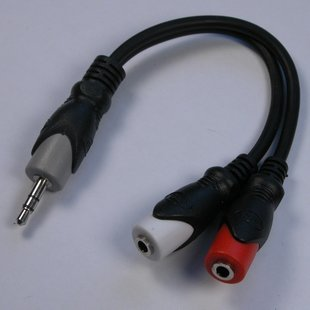

Doubles the number of transmit channels on USB IR Transceiver (socket & hybrid versions) by splitting USB IR Transceiver’s stereo 3.5 mm socket into two mono 3.5 mm sockets for use with [IR Emitters](/products/wired-ir-emitter.html). Only necessary if you want to use two channels per socket. For one channel per socket, IR Emitter can be connected directly into socket on USB IR Transceiver (but please read about [setting the channels](https://github.com/iguanaworks/Wiki/blob/master/pages/usbir/faq.txt)).
