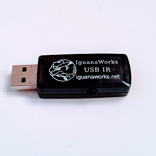
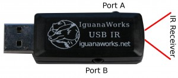

USB device to send and receive IR: have your computer send IR signals to your DVR; receive IR signals from a remote control. Works under Linux and Windows.Our standard USB IR Transceiver can send and receive infra-red (IR) signals. It comes in 3 different variations. Common to all versions:

- Receive Standard 38 kHz IR Signals
- Transmit IR Codes at (25 – 125 kHz carrier frequency)
- USB device works under Linux and Windows

The difference between the three version are how IR is transmitted and received:

- **Dual Socket**: Contains two stereo 3.5mm jacks for connecting [wired IR emitters](/products/wired-ir-emitter.html) (also called blasters). Each jack can control two independent transmit channels, enabling a total of 4 independent IR sending channels. To transmit IR using this device, you need one of our [IR Emitters](/products/wired-ir-emitter.html) per channel. To use two channels per socket, you need a [stereo->mono adapter](/products/stereo-mono-splitter.html). Device has one on-board receive unit.
- **Socket Receive**: One stereo 3.5mm jack for connecting [wired IR emitters](/products/wired-ir-emitter.html) and one stereo 3.5mm jack for connecting a [wired receiver](/products/wired-ir-receiver.html).

## Transmit Channels

| Device Type | Port A | Port B |
| --- | --- | --- |
| Dual Socket | Channels 1 & 2\* | Channels 3 & 4\* |
| Socket Receive | Channels 1 & 2\* | Receive Socket |

\* Channel only accessible with [stereo->mono adapter](/products/stereo-mono-splitter.html) Uses on-board LED Requires [wired IR emitter](/products/wired-ir-emitter.html)

## Receive Channels

Dual Socket, Dual LED and Hybrid all have on-board IR receivers opposite USB connector.

Socket Receive version does not have on-board IR receiver, but Port B accepts a [wired IR receiver](/products/wired-ir-receiver.html). Socket Receive cannot receive IR signals without a separate wired IR receiver.

## Specs

- Receive standard 38kHz carrier IR signals used by most remotes
- Transmit IR with 10ft transmit range (depending on receiver) and 50° cone angle
- USB device compatible with USB 1.1 and 2.0
- Transmit IR on up to 4 independent channels.
- User adjustable transmission carrier frequency from 25kHz to 100kHz
- Compatible with [LIRC](http://www.lirc.org/) and [WinLIRC](http://winlirc.sourceforge.net/)

## Overview

Our USB IR Transmitter/Receiver is a standard USB device that can transmit and receive the infrared codes supported by [LIRC](http://www.lirc.org/) (Linux only) and [WinLIRC](http://winlirc.sourceforge.net/) (Windows only). Combined with (Win)LIRC, this device can communicate with most home electronics, such as TVs, stereos, DVD players, receivers, and their associated remote controls. When used with [MythTV](http://www.mythtv.org/), you can turn your computer into a TiVo-like media center. We can send and receive IR under Linux and Windows. We do not support MAC OS X, although there is an [UNSUPPORTED MAC OS/X project](http://www.staarcom.com/software/IRControl/). Decoding remote control commands is currently supported under Linux via [LIRC](http://www.lirc.org/) and under Windows via [WinLIRC](http://winlirc.sourceforge.net/). Our software, both binaries and source code, is available in the [Downloads](https://www.iguanaworks.net/downloads.php) section and is licensed under the [GPL](http://www.gnu.org/copyleft/gpl.html). We happily accept patches to our code. We would like to extend the ability to decode remote control signals MAC OS/X either through LIRC or an alternative. If you would like to help us with that, or any make any other software contributions, please [contact us](https://www.iguanaworks.net/contact.psp).

## Accessories

* [Wired IR Emitter](/products/wired-ir-emitter.html)
* [Wired IR Receiver](/products/wired-ir-receiver.html)
* [Stereo -> Mono Splitter](/products/stereo-mono-splitter.html)
